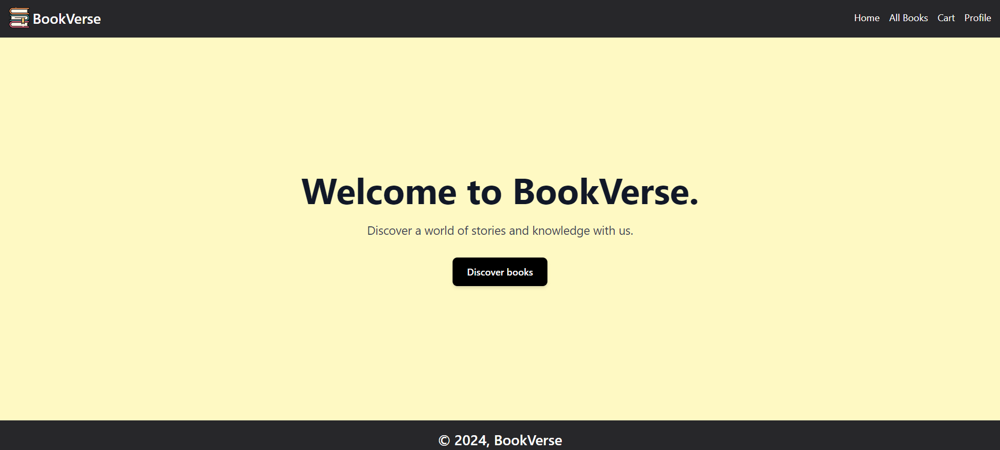

# BookVerse

**BookVerse** is a comprehensive online bookstore application built with modern web technologies. It offers a seamless experience for users to browse, purchase, and manage books, while providing administrative functionalities for managing the book inventory. The application is designed using the MERN stack (MongoDB, Express.js, React, Node.js) and features a clean, user-friendly interface with various functionalities for both users and administrators.

## Features

### User Features
- **Browse Books:** View a catalog of books with details such as title, author, price, and language.
- **Book Details:** Get detailed information about individual books, including descriptions and images.
- **Shopping Cart:** Add books to your cart, view the cart, and proceed to checkout.
- **Favorites:** Save books to a favorites list for easy access later.
- **Order History:** View past orders.

### Admin Features
- **Manage Books:** Add, update, and delete books from the inventory.

## Screenshots

Here are some screenshots of the BookVerse application:

### Homepage


### Book Details Page


### All Books Page


### Favourites Page


### Orders Placed


### Admin Dashboard


## Tech Stack

- **Frontend:** React, Tailwind CSS
- **Backend:** Node.js, Express.js
- **Database:** MongoDB
- **Deployment:** Netlify (Frontend), Render (Backend)

## Installation

### Prerequisites

- Node.js (v14 or later)
- npm (v6 or later)
- MongoDB

### Setup

1. **Clone the Repository:**

    ```bash
    git clone https://github.com/samreen-19/BookVerse-Source.git
    cd BookVerse-Source
    ```

2. **Setup Backend:**

    - Navigate to the `backend` directory:

        ```bash
        cd backend
        ```

    - Install dependencies:

        ```bash
        npm install
        ```

    - Create a `.env` file in the `backend` directory with the required environment variables. Example:

        ```env
        URI=your_mongodb_uri
        PORT=5000
        ```

    - Start the backend server:

        ```bash
        nodemon app.js
        ```

3. **Setup Frontend:**

    - Navigate to the `frontend` directory:

        ```bash
        cd ../frontend
        ```

    - Install dependencies:

        ```bash
        npm install
        ```

    - Start the frontend application:

        ```bash
        npm run dev
        ```

## Deployment

- **Frontend:** Deployed on [Netlify](https://www.netlify.com/). For deployment, follow Netlify’s deployment guide.
- **Backend:** Deployed on [Render](https://render.com/). For deployment, follow Render’s deployment guide.

## License

This project is licensed under the MIT License - see the [LICENSE](LICENSE) file for details.
